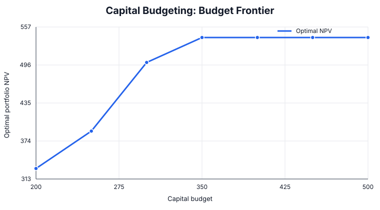

# Capital Budgeting Under Strategic Constraints

An original Management Science case study on selecting a portfolio of investment projects when capital, management attention, implementation dependencies, and risk tolerance are limited.

## Management question

Which projects should the firm fund this cycle, and which constraint is actually limiting portfolio value?

## Model

A binary mixed-integer model maximizes portfolio NPV subject to total capital expenditure, management capacity, portfolio risk, project dependencies, and mutually exclusive implementation windows.

## Run

~~~bash
pip install -r requirements.txt
python capital_budgeting.py
python analysis.py
~~~

## Baseline result

Recommended portfolio:

- Automation
- Analytics Platform
- Service Expansion

| Metric | Result |
|---|---:|
| Total NPV | 540 |
| Capital used | 340 / 350 |
| Management capacity | 12 / 12 |
| Risk score | 8 / 9 |

The important diagnostic is that **management capacity is binding**, while 10 units of capital and 1 unit of risk capacity remain unused.

## Sensitivity analysis

| Capital budget | Optimal NPV |
|---:|---:|
| 200 | 330 |
| 250 | 390 |
| 300 | 500 |
| 350 | 540 |
| 400 | 540 |
| 450 | 540 |

Risk-limit sensitivity also shows discrete portfolio changes: the optimal NPV rises from 330 at a risk limit of 4, to 490 at 7, and to 540 at 8.

## Managerial insights

- Additional funding has value up to roughly the **350** budget region, but capital is not the binding constraint in the baseline portfolio.
- Raising the capital budget beyond 350 without increasing managerial bandwidth produces no additional NPV.
- The portfolio changes discontinuously as constraints relax; capital budgeting is therefore not a simple project ranking exercise.
- Risk capacity has material option value up to a limit of about **8**. Beyond that level, another constraint dominates.
- The practical implication is to fund execution capability alongside projects: management attention can be scarcer than money.

All data are synthetic and created specifically for this flagship case.
