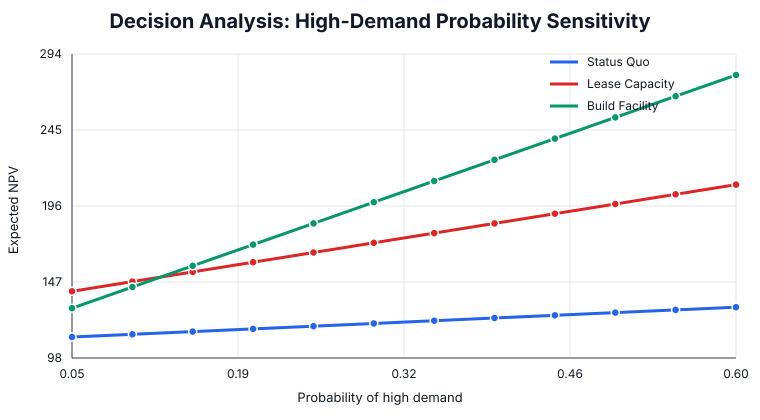

# Decision Analysis for Capacity Expansion

An original Management Science flagship combining risk-neutral decision analysis, regret, risk aversion, value of information, and probability sensitivity.

## Management question

Should management keep the current footprint, lease flexible capacity, or build a permanent facility when future demand is uncertain?

## Method

The case evaluates three alternatives across low, base, and high demand states using expected monetary value, expected regret, exponential utility and certainty equivalents, EVPI, probability sensitivity, and risk-tolerance sensitivity.

## Run

~~~bash
pip install -r requirements.txt
python decision_analysis.py
python analysis.py
~~~

## Baseline result

| Alternative | Expected NPV | Expected regret | Certainty equivalent (R=180) |
|---|---:|---:|---:|
| Status Quo | 118.75 | 103.75 | 117.69 |
| Lease Capacity | 166.25 | 56.25 | 150.97 |
| Build Facility | 185.00 | 37.50 | 111.71 |

The **risk-neutral** choice is Build Facility, while the **risk-adjusted** choice at risk tolerance 180 is Lease Capacity. EVPI is **37.50**, which is the maximum rational price for perfect demand information under the expected-value criterion.

## Sensitivity analysis

When the low/base demand probabilities retain a 1:2 ratio, Build Facility overtakes Lease Capacity at a high-demand probability of approximately **12.4%**. Risk tolerance also matters: the certainty-equivalent preference switches from Lease to Build only at a risk tolerance of roughly **560.5**.

## Managerial insights

- The highest expected-value alternative is not necessarily appropriate for a risk-averse decision maker.
- Flexible capacity functions as an economic hedge: it sacrifices upside to materially reduce downside exposure.
- The recommendation is sensitive to beliefs about high demand; probability elicitation is therefore a decision variable in practice, not a clerical input.
- EVPI provides a disciplined ceiling for spending on market research, pilots, or additional forecasting.
- Presenting both probability and risk-tolerance thresholds makes the decision auditable: executives can see exactly which assumptions must change before the recommendation flips.

All payoffs and probabilities are synthetic and created specifically for this flagship case.
