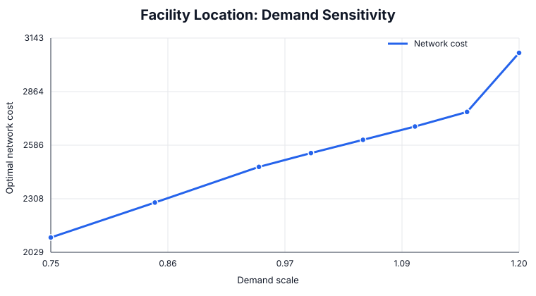

# Facility Location and Service Network Design

An original Management Science flagship on deciding which facilities to open and how markets should be assigned when fixed costs, service costs, demand, and capacity interact.

## Management question

Which candidate facilities should be opened, and how robust is that network to demand growth and cost changes?

## Model

The capacitated facility-location MILP minimizes fixed-opening plus demand-weighted service cost, subject to full market coverage, facility capacity, service only from open facilities, and a strategic limit on active sites.

## Run

~~~bash
pip install -r requirements.txt
python facility_location.py
python analysis.py
~~~

## Baseline result

The optimal network opens **Central** and **Coastal**.

| Metric | Result |
|---|---:|
| Total network cost | 2,545 |
| Central load | 160 / 180 (88.9%) |
| Coastal load | 125 / 160 (78.1%) |

The network carries some reserve capacity, but Central is already relatively highly utilized.

## Sensitivity analysis

| Demand scale | Optimal network | Total cost |
|---:|---|---:|
| 75% | North + South | 2,106.25 |
| 95% | North + South | 2,472.75 |
| 100% | Central + Coastal | 2,545.00 |
| 110% | Central + Coastal | 2,682.50 |
| 115% | Central + Coastal | 2,759.25 |
| 120% | North + South + Coastal | 3,066.00 |

Fixed-cost inflation also changes the preferred footprint: at 125% of baseline fixed cost, the optimal pair switches from Central + Coastal to North + South.

## Managerial insights

- Network design exhibits **structural thresholds**: a small parameter change can replace the entire preferred facility set.
- The baseline network is economical but not indefinitely scalable; around 20% demand growth a third site becomes necessary.
- Site decisions should therefore be evaluated with growth scenarios, not only current demand.
- High utilization at Central is an early warning indicator: its apparent efficiency also makes it the principal capacity-risk node.
- Fixed-cost assumptions matter enough to reverse the preferred two-site network, so lease, real-estate, and operating-cost estimates deserve explicit scenario testing.

All data are synthetic and created specifically for this flagship case.
