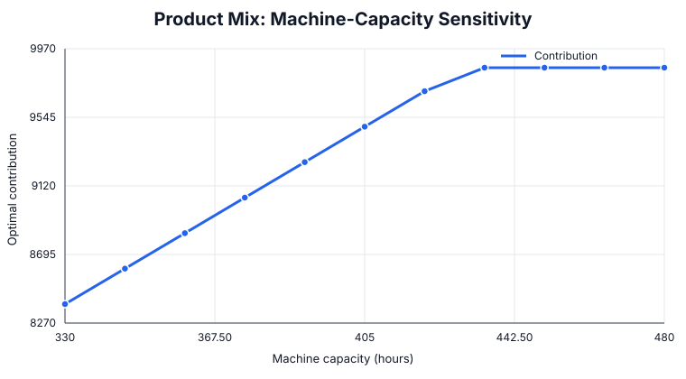

# Product Mix and Capacity Planning

An original Management Science case study on choosing a profit-maximizing product portfolio under scarce machine, labor, material, and demand capacity.

## Management question

Which products should management produce, in what quantities, and which constrained resource is worth expanding?

## Model

The linear program maximizes total contribution margin subject to machine hours, labor hours, material availability, product-specific demand ceilings, and nonnegative production quantities.

## Run

~~~bash
pip install -r requirements.txt
python product_mix.py
python analysis.py
~~~

## Baseline result

| Metric | Result |
|---|---:|
| Optimal contribution | 9,706.67 |
| Standard | 5.00 |
| Premium | 0.00 |
| Industrial | 66.67 |
| Eco | 140.00 |

Resource economics at the baseline:

| Resource | Slack | Marginal value |
|---|---:|---:|
| Machine | 0.00 | 14.67 |
| Labor | 0.00 | 4.67 |
| Material | 18.33 | 0.00 |

Machine and labor are simultaneously binding. Material is not scarce in the current solution, so buying more material has no first-order economic value.

## Sensitivity analysis

| Machine hours | Optimal contribution |
|---:|---:|
| 360 | 8,826.67 |
| 390 | 9,266.67 |
| 420 | 9,706.67 |
| 435 | 9,853.33 |
| 450 | 9,853.33 |
| 480 | 9,853.33 |

## Managerial insights

- Around the baseline, one additional machine hour is worth about **14.67** contribution units, making machine capacity the most valuable immediate expansion lever.
- The benefit of machine expansion disappears around **435 hours**. Beyond that point, the bottleneck shifts and extra machine time alone does not improve the objective.
- Labor becomes the dominant constrained resource after the machine bottleneck is relieved.
- Premium is excluded from the optimal mix despite its high unit margin because its resource consumption is unattractive relative to competing products.
- Capacity investment should therefore be sequenced: relieve the machine constraint first, then reassess labor rather than expanding all resources simultaneously.

All data are synthetic and created specifically for this flagship case.
