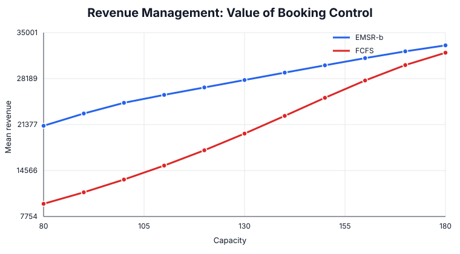

# Revenue Management with EMSR-b Booking Limits

An original Management Science flagship implementing a classic nested booking-control policy for a capacity-constrained service.

## Management question

How much capacity should be protected for higher-paying customers, and when is sophisticated booking control economically valuable?

## Method

The case implements EMSR-b and compares it through Monte Carlo simulation with unrestricted first-come-first-served (FCFS) selling.

## Run

~~~bash
pip install -r requirements.txt
python revenue_management.py
python analysis.py
~~~

## Baseline policy

For capacity 120, the approximate protection levels are:

| Fare class boundary | Protection | Booking limit |
|---|---:|---:|
| Business | 0.0 | 120.0 |
| Flex | 14.6 | 105.4 |
| Saver | 48.5 | 71.5 |
| Basic | 103.6 | 16.4 |

With 5,000 seeded Monte Carlo replications:

| Metric | Result |
|---|---:|
| EMSR-b mean revenue | 26,878.55 |
| FCFS mean revenue | 17,571.18 |
| Mean revenue lift | 9,307.37 |
| EMSR-b mean spoilage | 9.18 units |

## Sensitivity analysis

The value of booking control is highest when capacity is scarce. In the seeded experiment the revenue lift is about 11.7k around capacity 90, 9.3k at capacity 120, 4.8k at 150, and only about 1.1k at 180.

## Managerial insights

- Revenue management matters most when **capacity is scarce relative to heterogeneous demand**.
- FCFS systematically sells too much low-fare capacity early, destroying the option to serve later high-value demand.
- Protection is not free: the policy deliberately accepts some expected spoilage in exchange for preserving high-fare opportunity.
- As capacity becomes abundant, the opportunity cost of low-fare acceptance falls and sophisticated protection rules create less incremental value.
- The operating question is therefore not “should we protect capacity?” but “how much scarcity and fare dispersion justify protection?”

All demand distributions and fares are synthetic and created specifically for this flagship case.
